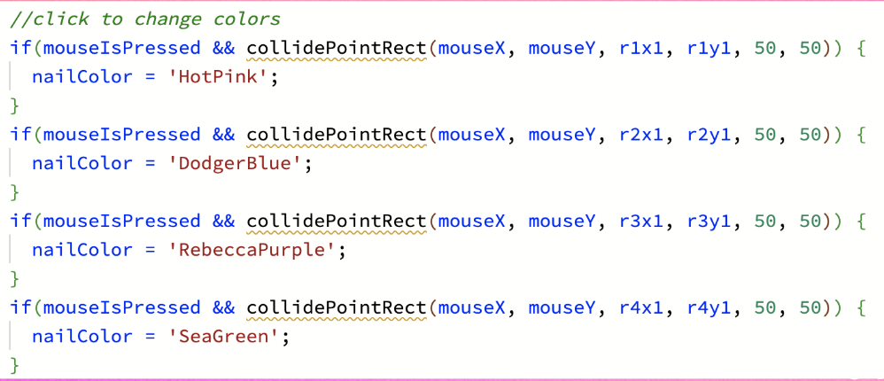
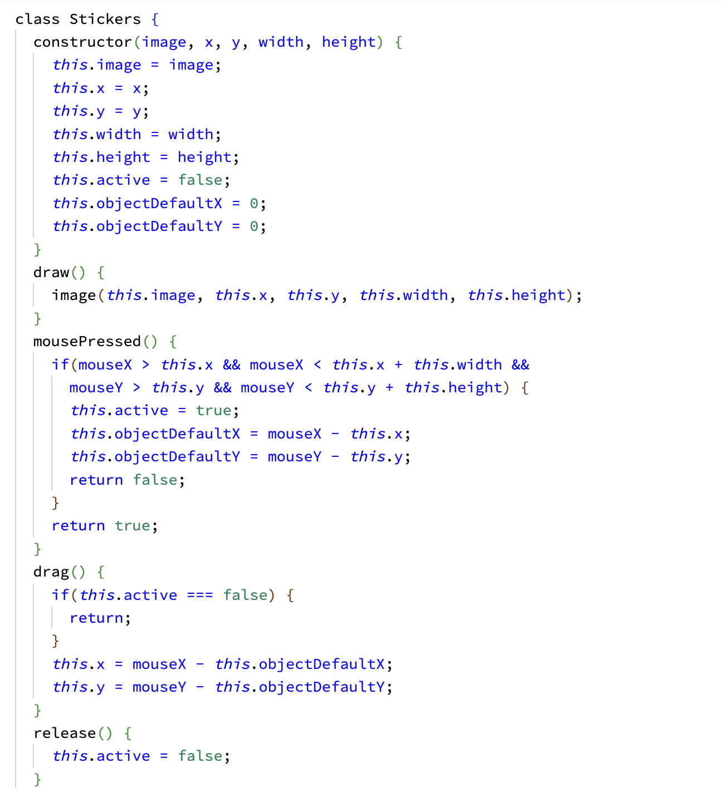

# Autumn & Monina's Nail Salon
Autumn Cabral: cabrala8@emmanuel.edu
Monina Tosi: tosim@emmanuel.edu

# Brief Description of Project
The game is designed to resemble a Barbie nail design game, allowing players to change the color of the nails by clicking on the different shades of nail polish and dragging and dropping the sticker gems to where they see fit on the nails. This project displays the drag and release function in codio.

# Instructions
Click a nail polish bottle to apply your desired color to the nails. Then, drag and drop gems from the sticker section onto the nails! To reset, refresh the game. Most importantly- have fun!

# The Process
We originally wanted to make each nail a different color, but quickly realized it would be more doable to make nail polish buttons to change the colors of all nails. Although we cut back from our original plan, this was still a difficult task for us to accomplish! We eventually figured out how to make these buttons by looking back at previous assignments (Smart Boxes), and with help from Mark to create collisions. The drag & drop feature was also difficult, but after looking through source code we were able to upload our images into an array. At first, this function was riddled with bugs, but with more help from Mark we were able to locate the issues in our code and get it to run smoothly.   

# Code We're Proud of! 
  ## Monina's Pride
  I am really proud of our "click to color" function on the nail polish bottles! I had never used collisions before, but they were very helpful when creating these buttons. I think this code really shows my progress in the class, especially compared to my first classwork assignment "Smart Boxes" 
  
  ## Autumn's Pride  
  I am proud making the cursor look like a nail polish brush. It was definitely the least stressful part of this project and it turned out very well. I am also proud of the drag and drop as we never learned it during class. In order to complete this task, we learned how to use the template "class" which allowed us to give the same instructions to all of the gemstone stickers so that they could easily be dragged and dropped onto the nails. It was fun to learn a new function and it challenged us to use our knowledge we had from class to execute our vision. 
   

# Credits
Our background image (SalonBackground.jpg), as well as gem stickers (Stickers pngs), were created on Canva, which permits the use of their images in both personal and professional contexts through their Contributor Licensing Agreement. 
https://www.canva.com/ 

Updated 7 December 2023

